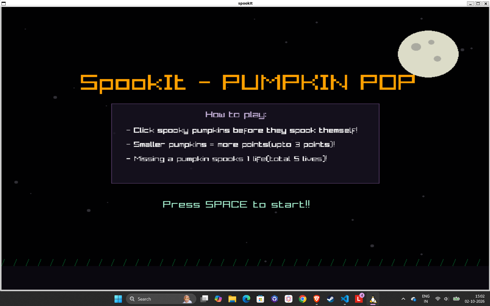
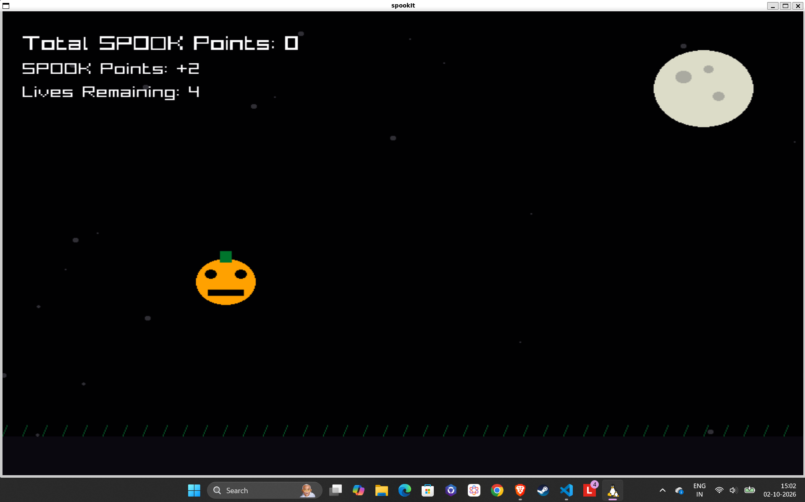

# spookIt (Pumpkin Pop)
> pop spooky pumpkins and score points before they pop themself

## Description 
A Clean, interactive C++ game built from scratch using Raylib Library. Players test their reflexes by clicking on spooky pumpkins that spawn dynamically in time. The game features progressive difficulty, animations, and a night sky aesthetic that is based on a dark and spooky theme.

## Preview



## Features 
**Modular Architecture:** Cleanly organized codebase separating game mechanics.
**Responsive Display:** The game automatically scales to fit any window size or full screen mode.
**Progressive Difficulty:** The game speeds up the longer the player survives.
**Aesthetic Visuals:** Custom Visuals defined to match the dark and spooky theme.

## Technologies & Tools
Language: C++
Library: Raylib
Build System: GNU Make (Makefile)

## How to play spookIt
To run and play spookIt locally, follow these steps:
1. **Clone the repository:**
   ```bash
   git clone [https://github.com/th25thbam/spookIt](https://github.com/th25thbam/spookIt)
   cd spookIt
2. Ensure dependecies like Raylib are installed [https://github.com/raysan5/raylib]
3. Compile and run using Makefile
    ```base 
    make run
